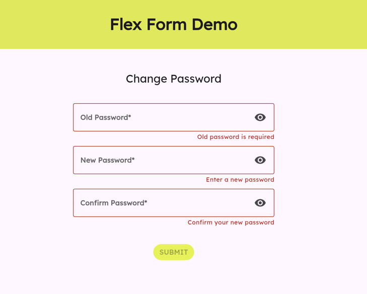

<!--
This README describes the package. If you publish this package to pub.dev,
this README's contents appear on the landing page for your package.

For information about how to write a good package README, see the guide for
[writing package pages](https://dart.dev/guides/libraries/writing-package-pages).

For general information about developing packages, see the Dart guide for
[creating packages](https://dart.dev/guides/libraries/create-library-packages)
and the Flutter guide for
[developing packages and plugins](https://flutter.dev/developing-packages).
-->
## Overview

Form development typically involves duplication of code at many levels from managing user interactions with a form to handling the loading and submission of the form's data. And depending on the complexity of a form and the number of forms required by an application, the effort to develop and maintain the forms can grow quickly.

This is why Flex Form was born with the following goals:

1. [ ] Consolidating all essential form interaction logic and providing it to any form by default.
2. [ ] Streamlining the development of forms by making it highly configurable and extensible.
3. [ ] Supporting all types of form inputs while leaving it up to developers to provide the UI for their forms.
4. [ ] Enabling extension of form's custom validation while providing APIs and hooks for more control of the forms at runtime.


## Features

1. [ ] **Flexibility** - Flex Form supports forms with all popular input types which include text, single-select, multi-select and toggle inputs.
2. [ ] **Configurable** - Flex Form provides fields configurations which can be used to configure each field's value requirements such as `required`, `min`, `max`, and `regex`.
3. [ ] **Extensible** - Flex Form enables forms of any level of complexity from a Login form to forms with any number of fields.
4. [ ] **Customization** - Flex Form enables easy integration of custom validation logic based on the business requirements.
5. [ ] **UI-independent** - Flex Form does not dictate how forms should look and feel. Instead, it takes care all of the basic form input interaction and provides update of the form's state which the application can use to build the form.
6. [ ] **Modular** - Flex Form's architecture enables developers to build form components that provide specific functionalities for the form based on the application's domain requirements. These components can be developed and tested independently of Flex Form. 

## Getting started

Flex Form's architecture is based on the BLoC design pattern. Flex Form depends on [bloc](https://bloclibrary.dev/) and [flutter_bloc](https://pub.dev/packages/flutter_bloc), which are the popular packages that implement BLoC and provides a very good state management solution for Flutter applications.

Flex Form supports all platforms and there's no additional setup required to get started.

To get started, add a dependency to `flex_form` in your Flutter application. 

```
 dependencies:
    ...
    flex_form: any
```


## Usage
### Architecture

The following components make up a Flex Form:
1. **FormBloc** - A base class which extends the `Bloc` class and provides all of the functionalities for a form. It requires a `FormValidationProvider<FormDataEntity>` and a `FormInputDataMapper` which are needed by the extended FormBloc.
2. **FormValidationProvider** - An interface defining validation functionalities used by the base `FormBloc` to validate a form.
3. **FormDataProvider** - An optional component for loading and submitting a form. This is useful for forms that need to load data from or submit data to remote APIs.
3. **FormInputDataMapper** - An interface defining functionalities for mapping between a form's "presentation" data (i.e. `Map<FormFieldId, dynamic>`) and the form's data model (i.e. `FormDataEntity`).
4. **FormDataEntity** - A base `Equatable` class to be extended by a form to represent a form's data.
5. **FormFieldConfig** - Defines a set of configurations for a form field which is used by `FormBloc` to handle specific events triggered by the form field. (E.g. OnChange, etc.)
5. **InputViewModel** - A Union class including classes that define the data for a form field based on the type of that field. (e.g. `FormFieldConfig.text`, `FormFieldConfig.singleSelect`, `FormFieldConfig.multipleSelect`, and `FormFieldConfig.toggledValue`)
6. **FormVM** - Contains the data for the whole form during the form's life cycle.
7. **FormComponent** - A Flutter widget which is used to wrap around the form UI to be built. `FormComponent` allows forms to specify either a `FormDataBuilder` or a `FormInputBuilder`. Use the `FormDataBuilder` when building forms with custom UI and use `FormInputBuilder` to build a form with the set of `TextInputs` returned by the builder.
8. **validateField** - A utility function for validating a form field's value against its FormFieldConfig.
9. **getValidationMessage** - A utility function for getting the validation message for an invalid FormFieldValidation.

### How to Implement a Form
1. Extend the `FormDataEntity` class to define the data for the form and override the Equatable's `props` getter. This is required by the `FormValidationProvider` to check if the form is valid as form's inputs change. 
2. Optionally extend the `FormValidationProvider` base class to provide custom implementations for the `isDirty`, `isValid`, `validate` and `validateUponSubmission` APIs.
3. Implements the `FormInputDataMapper` interface to provide mapping functionalities between the form's input map and the form's `FormDataEntity`.
4. Extends `FormBloc` and provides a constructor which crates an instance of a FormBloc with an initial `FormBlocState`, a `Map<FormFieldId, FormFieldConfig>` inputConfigMap, an instance of the extended `InputDataMapper` class, an optional `FormValidationProvider` and an optional `FormDataProvider`. 

To FormFlex in action, check out the `form_with_data_builder.dart` and `form_with_text_input_builder.dart` examples located in the `/demo` folder. These examples demonstrate how to build a form with the `FormInputBuilder` and `FormDataBuilder` builders.

[Example of a form built with a TextInputBuilder]
```dart
    FormComponent(
      bloc: _changePasswordFormBloc,
      textInputBuilder: ({
        buttonText,
        canSubmit,
        cancelButtonText,
        required context,
        onSubmit,
        required textInputs,
      }) {
        return Column(
          mainAxisAlignment: MainAxisAlignment.start,
          children: [
            Text(
              _changePasswordFormBloc.state.data.title!,
              style: Theme.of(context).textTheme.titleLarge,
            ),
            const SizedBox(height: 25),
            ...textInputs,
            const SizedBox(
              height: 35,
            ),
            TextButton(
              onPressed: canSubmit == true ? () {} : null,
              style: TextButton.styleFrom(
                backgroundColor: Theme.of(context).colorScheme.primary,
                foregroundColor:
                    Theme.of(context).textTheme.titleLarge!.color,
              ),
              child: Text(buttonText!),
            )
          ],
        );
      },
    )
```

[Example of a form built with a DataBuilder]
```dart
    FormComponent(
      bloc: _changePasswordFormBloc,
      dataBuilder: (
          {buttonText,
          canSubmit,
          cancelButtonText,
          required context,
          focusNodeMap,
          required inputMap,
          isLoading,
          isSubmitting,
          onChangeCallbackMap,
          onSubmit,
          textControllerMap}) {
        final oldPasswordViewModel =
            inputMap[FormFieldId.fd0] as TextInputViewModel;
        final newPasswordViewModel =
            inputMap[FormFieldId.fd1] as TextInputViewModel;
        final confirmNewPasswordViewModel =
            inputMap[FormFieldId.fd2] as TextInputViewModel;

        obscurityInputMap ??= <FormFieldId, bool>{
          FormFieldId.fd0: oldPasswordViewModel.isInputObscured,
          FormFieldId.fd1: newPasswordViewModel.isInputObscured,
          FormFieldId.fd2: confirmNewPasswordViewModel.isInputObscured,
        };
        return Column(
          mainAxisAlignment: MainAxisAlignment.start,
          children: [
            Text(
              _changePasswordFormBloc.state.data.title!,
              style: Theme.of(context).textTheme.titleLarge,
            ),
            const SizedBox(height: 25),
            ...inputMap.keys.map(
              (fieldId) => Column(
                children: [
                  const SizedBox(height: 10),
                  StatefulBuilder(
                    builder: (context, setState) {
                      return TextInput(
                        theme: theme.textInputTheme,
                        viewModel:
                            (inputMap[fieldId] as TextInputViewModel)
                                .copyWith(
                                    isInputObscured:
                                        obscurityInputMap![fieldId]!),
                        focusNode: focusNodeMap![fieldId]!,
                        controller: textControllerMap![fieldId],
                        onChange: onChangeCallbackMap![fieldId]!,
                        suffixIcon: IconButton(
                          onPressed: () => setState(() =>
                              obscurityInputMap![fieldId] =
                                  !obscurityInputMap![fieldId]!),
                          icon: const Icon(Icons.visibility),
                        ),
                      );
                    },
                  ),
                ],
              ),
            ),
            const SizedBox(
              height: 35,
            ),
            TextButton(
              onPressed: canSubmit == true ? () {} : null,
              style: TextButton.styleFrom(
                backgroundColor: Theme.of(context).colorScheme.primary,
                foregroundColor:
                    Theme.of(context).textTheme.titleLarge!.color,
              ),
              child: Text(buttonText!),
            )
          ],
        );
      },
    )
```

## Additional information
1. To run the live demo of the examples, configure and install [melos](https://melos.invertase.dev/) and build the `demo` package by running `melos build:form-demo`. Once the demo is built, run `flutter run -t demo/lib/main.dart -d chrome` to run the demo.



2. For more details about how the Flex Form works, refer to this Medium [TBD] article. 

## How to contribute
### How to build FormFlex
1. Run the following command to do a clean build of all of the packages (i.e. `flex_form` and `flex_form_demo`) in the project.

```melos clean-build:form``` 

2. Optionally the following commands to build each package separately.

```melos build:form``` 

```melos build:form-demo```

3. Lint the project before opening a PR by running

```melos analyze```


## TODOs
1. [X] Convert FormValidationProvider into a base class.
2. [ ] Add documentation and tutorials
3. [ ] Code Generation and other tools to improve development workflow
4. [ ] Add Tests
